<!-- This file provides the CONTENT for the MMAP website -->
<!-- javascript links are at the bottom of this file to improve page loading -->

<div class="toc-wrapper">
  <ol class="toc js-toc"></ol>
</div>

<p><a id="home" title="MMAP Introduction" class="toc-item"></a></p>

<!--# MMAP by Jeff O'Connell-->

[**HOME**](/) &nbsp; &nbsp; [**Latest Release**](https://github.com/MMAP/MMAP-releases-issues-Q-and-A/releases/latest){:target="_blank"} &nbsp; &nbsp; [**Issues and Q&A**](https://github.com/MMAP/MMAP-releases-issues-Q-and-A/issues){:target="_blank"} &nbsp; &nbsp; [**MMAP Cheat Sheet**](/CHEATSHEET.md)

## MMAP: Mixed Model Analysis for Pedigrees and Populations

MMAP is a comprehensive mixed model program for analysis of pedigree and population data. It provides an optimized and flexible platform that incorporates a wide range of covariance structures such as additive, dominance, epistasis, maternal and imprinting using pedigree and/or genotype data and also allows users to define their own covariance structures. Likelihood calculations use multi-threaded optimized matrix libraries to handle multiple random effects. MMAP can import data from a variety of imputation programs to avoid data manipulation and IBS/IBD programs to build covariance structures.

MMAP uses a fast low-memory method to calculate additive and dominant genetic covariance structures using SNP data, which can be quite challenging for large data sets. For polygenic SNP analysis MMAP can store SNP-covariance products to reduce the complexity subsequent analyses with the same subjects to linear regression, independent of phenotype or covariates.

<p><a id="installation" title="Installation" class="toc-item"></a></p>

### Installation

MMAP is statically compiled with the Intel Math Kernel library for the Unix/Linux environment and uses BLAS and LAPACK libraries. To ensure compatibility only a static executable is currently available. After download, be sure to make the file executable. [Click here to download MMAP](https://github.com/MMAP/MMAP-releases-issues-Q-and-A/releases/latest){:target="_blank"}.

<p><a id="pedigree" title="Pedigree Files" class="toc-item"></a></p>

### Pedigree Files

`--ped <csv pedigree file>` identifies the comma delimited pedigree file with header containing the first 5 tokens:  
```
  PED  - Pedigree ID
  EGO  - Individual ID
  FA   - Father ID
  MO   - Mother ID
  SEX  - sex (1 = male, 2 = female)
```

The ID is alphanumeric. MMAP expects IDs to be unique across pedigrees as there is no pedigree information in the phenotype file. Missing parents are coded as 0. Parents that do not have records as individuals are ignored and single missing parents are allowed. Unknown sex is not supported. There are two additional columns (not ordered) that will be interpreted by MMAP, if present.
```
  MZTWIN - non-zero integer as group identifier of genetically identical individuals
  COHORT - non-zero integer defines group effect (see section on variance components)
```
  
The pedigree is assumed to be in ancestral order which means parents are listed before offspring. Ancestral order is used for efficient computation of the relationship matrix. MMAP currently enforces ancestral order but allows parents to be listed that do have their own records. If errors are encountered, MMAP exists and errors are output to the file pedigree.csv, which can used to correct the problems.

Additional pedigree option:

`--single_pedigree` instructs MMAP to ignore the pedigree ID and interpret the pedigree file as a single pedigree. This option is useful when creating covariance matrices that include between-pedigree values such as genetic similarity through genotype data.

Example <!--[pedigree file](files/pedigree.txt){:download="pedigree.txt"}-->[pedigree file](files/pedigree.txt){:target="_blank"} contains two pedigrees. In the first pedigree there are two sets of genetically identical subjects: MGM and PGF, and 1, 2 and 3.

<p><a id="phenotypes" title="Phenotype Files" class="toc-item"></a></p>

### Phenotype Files

Phenotypes are stored in a comma delimited file with header. The first column is assumed to be individual ID (independent of actual header token). Currently only numerical traits and covariates are supported; they are read in as real numbers, but can be coded as integers in the file. Missing data is coded as blank.

`--phenotype_filename <phenotype file>` identifies the phenotype file to be read in.  
`--phenotype_id <header token>` identifies column containing individual id. Not needed if individual id is the first column.

`--trait <trait1> <trait2> ... <traitN>` identifies the traits to be analyzed.  
 &nbsp; NOTE: Currently only a single trait is supported. Multitrait analysis is being implemented.

Example [phenotype file](files/phenotype.txt){:target="_blank"} contains data for 5 subjects from the [pedigree file](files/pedigree.txt){:target="_blank"}. The subject identifier SUBJECT and trait BMI. Since SUBJECT is not in the first column, `--phenotype_id SUBJECT` is required. Note that subject PGM in this example [phenotype file](files/phenotype.txt){:target="_blank"} is missing the BMI measurement.

<p><a id="covariates" title="Covariates" class="toc-item"></a></p>

### Covariates & Covariate Files

Covariate files are optional comma delimited files with header line with covariate name. Covariate files also assume the first column contains the individual ID unless the `--phenotype_id` is used. MMAP first searches the phenotype file for specified covariates, then the covariates files in order given. Thus, the first instance of the covariate is used if present in multiple files.

`--covariates <cov1> <cov2> ... <covN>` A list of covariates to be included in the analysis. If a covariate is not found in the phenotype file and/or covariate files, then the program exits. Individuals missing any covariate value are excluded from the analysis.

`--covariate_filename <file1> < file2> … <fileN>` Covariates specified by the `--covariates` option will be searched for in first the phenotype_file then sequentially through the list of covariate files. Thus, this option is only needed if covariates are not in the phenotype_file. The first file containing the covariate is used, thus there is no merging of within-covariate information across files. Covariate files can contain covariates with string values (so do not need to remove), but only covariates coded as numerical are currently supported. Missing data is coded as blank, so appear as “,,” in the csv file. Future options will include expanding a covariate into categorical values; for example, a single column containing four seasons would be expanded as 3 covariates. If no covariate files are given, then MMAP searches in the file specified by `--phenotype_filename` . If a covariate is not found, MMAP exits.

Example [covariate file](files/covariate.txt){:target="_blank"} contains data for 4 subjects from the pedigree file. The individual identifier SUBJECT must be the same as in the phenotype file. Subject 11 is missing AGE covariate.

NOTES:
- Caution when using Excel: If creating csv files form Excel it is recommended that a dummy column is added at the end because if there an individual has consecutive missing values in the file up the last column, sometimes the following rows get truncated. Excel will convert blanks to zeros when converting values. For example, if converting height from cm to inch by dividing the cm column by 2.54, missing cm values get a 0 in the inch column. Make sure no column has multiple values that are space/tab delimited as the column entries in the row will be shifted when exporting as csv.
- When moving a file from a Windows PC, run `dos2unix <windows-file>` to remove carriage returns.
- When moving a file from a MAC, run `mac2unix <mac-file>` to convert carriage returns to line feeds.

<p><a id="genotypes" title="Genotype Files" class="toc-item"></a></p>

### Genotype Files

MMAP uses binary only files for genotype analysis. For genome-wide association analysis the marker-by-subject (MxS) format is most efficient. MMAP provides utilities to convert comma separated text files with header to binary. The basic MxS format is as follows:
```
  SNPNAME            marker identifier
  RSNUM              rsnumber (or second SNP identifier)
  CHR	             1-22, X, Y, XY, MT
  POS	             position in base pairs
  STRAND	     +,- or blank
  NON_CODED_ALLELE   homozygote has dosage 0
  EFFECT_ALLELE	     homozygote has dosage 2
```
Only SNPNAME is required to be present, but default values of 0 for CHR and POS, ? for STRAND and 1 and 2 for the NON-CODED_ALLELE and EFFECT_ALLELE, respectively, will be entered if the tokens are not found. The file can contain any number of additional columns but must come before the list of individual IDs. These additional columns can be included in the genotype file and be used as filters or annotation by referencing the token in the header line in the appropriate command. Genotypes are stored in a variety of formats. Observed data is stored using 16 codes that represent phased and unphased states, partially typed states, and missing values. Thus, observed data is stored in a single byte. Imputed dosages can be stored as one or two bytes by scaling the value or as a double. One byte stores multiply the dosage by 100 so get 2 decimal place accuracy; two bytes multiplies by 10,000 so 4 place accuracy. If the original data is imputed dosage and not observed genotypes then the appropriate command line must be added to tell MMAP what data to expect. MMAP assumes comma-separated files (csv), but accepts space delimited also by adding `--genotype_space_delimiter` to the command line. MMAP accepts gzipped genotype files as input also. No additional command lines are necessary.

Example [genotype file](files/genotypes.txt){:target="_blank"} contains data for 5 subjects from the pedigree file using Affymetrix SNP ids as SNPNAME. The token STRAND is missing so the value will be set to ?. Marker SNP_A-2236359 has no rsnumber and is a deletion. Missing genotype values are coded as 3. There are two additional columns GENE and GROUP that can be included in the binary genotype file if desired. The following two commands are required to convert the text file to binary.

`--write_binary_genotype_file --csv_input_filename <input file> --binary_output_filename <output file>` converts the input file into MMAP binary format in the output file.

`--num_skip_fields` The number of columns to skip before the first subject ID. This command is required.

`--genotype_dosage_short` stores dosage as 10000*value, so suitable for dosage with 4 decimal place accuracy

`--genotype_dosage_char` stores dosage as 100*value, so suitable for dosage with 2 decimal place accuracy

`--genotype_dosage_double` stores dosage as value in file

`--genotype_space_delimiter`  add if genotype file is space rather than comma delimited

`--additional_marker_attributes <token1> <type1> … <tokenN> <typeN>` type is C for character string, D is double, I is integer. This option will include the additional columns from the genotype text file, if present.

`--output_marker_attribute <token1> <token2> … <tokenN>` The output file for GWAS will contain the standard tokens. Additional columns can be included using this option.

<p><a id="marker_options" title="Marker Options" class="toc-item"></a></p>

#### Options for marker analysis

`--chromosome <chrA> ... <chrN>` Analysis is restricted to chromosomes listed in the command line. Currently limited to autosomes Non-autosome chromosomes are designated by standard nomenclature: X, Y, XY, and MT.

`--genomic_region <chrA> <bp_startA> <bp_endA> … <chrN> <bp_startN> <bp_endN>` Analysis is restricted to genomic regions specified by chromosome and bp window. Base pair values. –chromosome 4 would be the same as –genomic_region 4 0 5000000.

`--marker_set <text file>` Analysis is restricted to the set of markers in the marker file. MMAP searches the SNPNAME and RSNUM columns to match the markers listed. NO header in the file.


<p><a id="analysis" title="Analysis Set" class="toc-item"></a></p>

### Analysis set

MMAP takes the intersection of subjects in the pedigree and phenotype and also covariate and genotype files, if present, to generate the set of subjects used for analysis. Subjects with missing phenotype or covariate values are dropped. MMAP has an option to specify a subject set file, that if present, will also be included in the intersection. In the phenotype and covariate examples above the analysis set would for BMI with covariates AGE would be subject F from pedigree 1 and subject 12 from pedigree DM. If the genotype file is included then the analysis set contains only subject F.

`--subject_set <input file>` Single column file with no header that will control the individuals included in the analysis. This set is intersected with individuals with data from the phenotype and covariate file.


<p><a id="running" title="Running MMAP" class="toc-item"></a></p>

### Running MMAP

MMAP requires that the binary relationship matrix be computed before any phenotype or genotype analysis. This matrix is then read in for other analyses.

`--compute_binary_relationship_matrix_by_groups <output file> --group_size <value>` Computes the pedigree specific relationship matrix (twice kinship) and stores in binary format to be read during analysis. Pre-computing this matrix is required to avoid recomputation for each analysis. The algorithm computes the matrix by groups to handle memory requirements of large pedigrees, as the matrix requires NxNx8 bytes of memory, where N is the number of individual. The binary file size is order NxNx4 bytes, thus depending on the application, it may be more efficient to restrict to the calculation to phenotyped individuals rather than the full pedigree by adding the subject_set option below. For example, when analyzing a Holstein pedigree of size ~240K with 60K genotyped animals only the 60K x 60K matrix was generated. For human pedigrees it is recommended to generate the full matrix as they rarely reach this size, even when the single_pedigree option is used.

Thus run the following command. Default group size is 1000.   
`mmap --ped <pedfile> --compute_binary_relationship_matrix_by_groups --binary_output-filname <output file> --group_size <value>`


<p><a id="output" title="Output Options" class="toc-item"></a></p>

### Output Options and Files:

`--file_suffix <string>` Adds string to output files to prevent clobbering from different analyses in the same directory

`--all_output` Generates additional output files that contain the likelihood values over the of h2 values, transformed phenotypes files.

`<trait>.<file_suffix>.poly.cov.csv` Contains trait statistics, number of observations, h2 estimate and p-value, beta, standard error and p-value of the fixed effects (uses t-test), percent variation the fixed effects account for, estimates of the total variance, additive variance, and error variance with standard errors. Also included is the standard errors of h2 estimate and standard error of the standard_deviation estimate (square root of variance estimate). MMAP uses the expected values of the information matrix, so no covariances between fixed and random effects are generated. Computing the matrix at the MLE estimates may be added in the future.

`<trait>.<file_suffix>.poly.cor.csv` The correlation/covariance between the beta estimators using the Fisher information matrix. The diagonal if the matrix is the standard deviation. Since expected values are used in the information matrix the covariance between fixed and random effects are assumed zero.

`<trait>.<file_suffix>.poly.model.csv` Contains the individuals used in the analysis, the observed phenotype, covariate values, fitted value and error residual calculated at the maximum likelihood estimate of h2. Other columns can be ignored and may be deleted in future versions. The column ERROR_RESIDUAL represents the residuals adjusted for the polygenic effect. These residuals can be treated as independent for analysis in programs that handle population samples.

`<trait>.<file_suffix>.spor.cov.csv` Same as poly version, but h2=0, so pedigree structure is ignored.

`<trait>.<file_suffix>.spor.cov.csv` Same as the poly version but h2=0, so pedigree structure is ignored.

<p><a id="example" title="Examples" class="toc-item"></a></p>

### Example Commands

`mmap --ped <pedfile> --read_binary_covariance_file pedigree.bin --trait HDL --phenotype_id MYEGO --phenotype_file pheno.csv --covariates AGE SEX BMI --covariate_file covarA.csv covarB.csv --file_suffix BMI`  
This command will analyze the trait HDL adjusting for covariates AGE, SEX and BMI. MMAP will look for the trait in pheno.csv then the covariates in the files pheno.csv, covarA.csv covarB.csv. The subject ID is assumed to by MYEGO in all three files. The output files with start with HDL and include BMI in the filename. The relationship matrix will be read from the file pedigree.bin

`mmap --ped <pedfile --read_binary_covariance_file pedigree.bin --trait HDL --phenotype_id MYEGO --phenotype_filename pheno.csv --covariates AGE SEX --file_suffix NO.BMI --binary_genotype_filename gwas.bin --model add --chromosome 4 X`  
This example is similar to that above except MMAP expects the covariates to be present in pheno.csv and BMI is dropped as a covariate. The file suffix is NO.BMI which will prevent the previous analysis results from being clobbered. MMAP will also perform marker analysis for chromosomes 4 and X using the additive model.

---

<p><a id="advanced" title="Advanced Topics" class="toc-item"></a></p>

### Advanced Topics

| Advanced&nbsp;Topic&nbsp;&nbsp;&nbsp;&nbsp;&nbsp;&nbsp;&nbsp;&nbsp;&nbsp;&nbsp;&nbsp;&nbsp;&nbsp;&nbsp;&nbsp;&nbsp;&nbsp;&nbsp;&nbsp;&nbsp;&nbsp;&nbsp;&nbsp;&nbsp; | Documentation file |
| --- | --- |
| Working with the binary genotype file | [MMAP.genotype.pdf](files/MMAP.genotype.pdf){:target="_blank"} |
| Importing data from other formats: PLINK, MINIMAC, IMPUTE2, VCF | [MMAP.import.export.pdf](files/MMAP.import.export.pdf){:target="_blank"} |
| Genomic Relationship Matrices and PCs | [MMAP.genomic.matrix.pdf](files/MMAP.genomic.matrix.pdf){:target="_blank"} |
| Variance Component Estimation | [MMAP.variance.components.pdf](files/MMAP.variance.components.pdf){:target="_blank"} |
| Pedigree and Environmental Covariance Matrices | [MMAP.covariance.matrix.pdf](files/MMAP.covariance.matrix.pdf){:target="_blank"} |
| GxG, GxE, ExE Interaction Analysis and Sandwich Estimators | [MMAP.interaction.pdf](files/MMAP.interaction.pdf){:target="_blank"} |

---

<p><a id="genotypes_pdf" title=" &nbsp; 1. Genotype Files" class="toc-item"></a></p>

### MMAP Genotype File

MMAP has commands to manipulate the binary genotype file.
To transpose the file from marker-by-subject (MxS) to subject-by-marker (SxM) or subject-bymarker
(SxM) to marker-by-subject (MxS)  
`mmap --transpose_binary_genotype_file --binary_input_filename <infile> --binary_output_filename <outfile>`

If you transpose twice then you will get the original file.  
&nbsp; \- MxS format is useful for GWA, computation of LD matrices and allele frequency calculations.  
&nbsp; \- SxM format is useful for computation of genetic covariance matrices and haplotype analysis.

Creating a marker and/or subject reduced binary genotype file. Same command applies to MxS
and SxM formats. The outfile is the new binary genotype file.  
`mmap --write_reduced_genotype_binary --binary_input_filename <infile> --binary_output_filename <outfile> [marker and subject options]`

Example options:
```
--autosome               Extract the autosomal SNPs  
--chromosome <numbers>   Extract SNP on chromosomes in <numbers>  
--genomic_region <chr> <start bp> <stop bp>    Extract SNPs in the genomic region(s) specified.
--marker_set <file>      Extract markers in <file>
--subject_set <file>     Extract subjects in <file>
--exclude_subject_set <file>   Extract all subjects excluding those in <file>
```

Extracting genotypes as csv file. The infile must be MxS format. The outfile has the results. The options above are valid with this
command.  
`mmap --marker_by_subject_mmap2csv --binary_input_filename <infile> --csv_output_filename <outfile>`

Extracting subject list from a genotype file.  
`mmap --write_binary_genotype_file_subject_list --binary_input_filename <infile> --txt_output_filename <outfile>`

Allele frequency calculations.  The allele frequency for each SNP will be in the csv file.  
`mmap --write_binary_allele_frequency_file --binary_input_filename <MxS file> --binary_output_filename <filename> --csv_output_filename <filename>`

---

<p><a id="import" title=" &nbsp; 2. Genotype Import" class="toc-item"></a></p>

### MMAP Import Options

MMAP has commands to import data from Plink, Minimac, IMPUTE2 directly into a binary
genotype file and commands to export to Mach and Beagle format. Some of these options are
being beta tested or under development.

#### Plink

MMAP imports Plink binary format files into an SxM or MxS genotype binary file, depending on
the Plink format, which is automatically detected. Example below converts files \<prefix\>.bim,
\<prefix\>.bed, \<prefix\>.fam into binary genotype file \<mmap prefix\>.bin and MMAP
pedigree \<mmap prefix\>.ped.csv extracted from the \<prefix\>.fam.  
`mmap --plink_bfile2mmap –plink_bfile <prefix> --binary_output_prefix <mmap prefix>`

#### Mach/MiniMac

MMAP imports Mach info and dosage files into an SxM binary genotype file. Since the map
information is not contained in the info file, the Mach map file is required. Dosage files can be
compressed or uncompressed. Options for reading in the probability file to create dominant and
recessive dosages are under development.  
`mmap --mach_dose2mmap –mach_info_filename <info file> --mach_dose_filename <dose file>
imputation_map_filename <map file> --binary_output_filename <SxM binary gentype
file> --genotype_dosage_short`  
\<info file> and \<dose file> are a list of Mach output files to be used. The chromosomes must be
in the same order in both files. The option `--genotype_dosage_short` stores the dosage as 2
bytes with precision 4-5 decimal places. The `--genotype_dosage_char` option will store the
dosage as 1 byte with 2-3 decimal place precision, reducing file size by half. It is recommended
to create a single binary file containing all the chromosomes for flexibility of analysis even
though the file will be large.

#### IMPUTE2

The IMPUTE2 import assumes that the probability .imputed and the information .imputed_info
files are available. Since subject id information is not contained in the output files, this
information must be included in the command line. This option is now set up to combine files per
chromosome to manage large files. Thus, the chromosome is required input. The default coding
is to use 1 byte. Since the probabilities are 3 decimal places, the 2 byte option is recommended.
The following conventions are used to handle the different variant types found in the current
imputation panels.  

Conventions:
1. SNPNAME is coded using the RSNUM value. If the marker was typed (2 in the output
column), the SNPNAME is the same as RSNUM, otherwise an “i” is appended. So rs123
becomes irs123
2. RSNUM is coded using the rs_id value in the .imputed or .imputed_info file, expect if it is
missing (dot in the output), then it is coded as <chr>:<position>. Use RSNUM when
reporting results.
3. STRAND is set to + by default as no strand information is available.
4. ALLELE as a coded as single characters using the nucleotides is both alleles are single
characters. Otherwise, R is used for the non-coded allele and I or D as the effect allele
depending on if the non-coded allele is a substring of the effect allele (I), or a superstring
(D). Marker with \<DEL\> are coded as R/R. MMAP outputs a file that contains the original
alleles and the codding. MMAP also supports multiallelic options where the alleles are as
the original but truncated beyond a maximum length.  
The following are required options:  
```
--impute2_prob2mmap
--impute2_prob_filename <file1> <file2> … <fileN>
--impute2_info_filename <file1> <file2> …<fileN>
--chromosome <chr>
--subject_id_filename <file>
--binary_output_filename <file>
--csv_output_filename <file>
```

The prob and info files should be in the same chunk order. The prob files can be gzip’d. The
subject id file does NOT have a header. The imputation quality score info is embedded in the
binary genotype file and can be outputted when running the single variant analysis. The default
is to create an additive dosage.

`--genotype_dosage_short` add this option to increase accuracy of stored dosage. Doubles file
size.  

Additional options to create alternative
dosage files:
```
--dominant_dosage creates dosage= 0*prob(AA) + 1*prob(AB) + 1*prob(BB)
--recessive_dosage creates dosage= 1*prob(AA) + 1*prob(AB) + 0*prob(BB)
--het_dosage creates dosage= 0*prob(AA) + 1*prob(AB) + 0*prob(BB)
```
**NOTE:** If you run `-–dom` with the binary_genotype_file created using `–dominant_dosage` you will
get a message that the option is not supported. For imputed data there is actually no model
since all genotypes have a value. The `-–dom` for observed data tells MMAP how to combine
genotypes into dominant dosages and to fill in missing values. These do not apply for in this
case. Thus, no model statement is needed.

Once the chromosome-specific files are created, they can then be combined into a single
MMAP binary using:
```
--combine_binary_genotype_files <file1> <file2> … <fileN>
--binary_output_filename <file>
```
The input files and output file are MMAP marker-by-subject binary genotype files.

**Recommendation:** To reduce the size of the combined binary genotype file, once the
chromosome specific files are created, run the allele frequency option. The output will contain
the minor allele frequency and imputation quality score, which can be used to extract a marker
set based on minor allele frequency and/or imputation quality threshold. This marker set can 
then be used to create reduced binary genotype files before combining to the full file. See
MMAP.genotype.pdf for details on these options.

#### VCF

Under development

---

<p><a id="export" title=" &nbsp; 3. Genotype Export" class="toc-item"></a></p>

### MMAP Export Options

#### Plink

`--subject_by_marker_mmap2plink --binary_input_filename <SxM binary gentype file> --
plink_output_prefix <prefix>`  
Creates \<prefix\>.map and \<prefix\>.ped which can then be converted into Plink binary format.
Currently no support of export directly into binary.

`--marker_by_subject_mmap2tped --binary_input_filename <SxM binary genotype file> --
plink_output_prefix <prefix>`  
Creates \<prefix\>.fam, \<prefix\>.bim and \<prefix\>.tped

#### Mach/Merlin

To be documented

#### Beagle

To be documented

#### MSMS

To be documented

#### ForSim

To be documented

#### Idcoeffs

To be documented

---

<p><a id="genomic_matrix" title=" &nbsp; 4. Genomic Matrices" class="toc-item"></a></p>

### MMAP Genomic Matrix Calculations

MMAP has options to compute relationship matrices using genetic markers. The markers may be genotypes or dosages. Additive and dominant covariance matrices are available using SNP or pooled variances. Options are available for single or double precision matrices with or without adjusting for missing data. The memory footprint is determined by the size of the subject group requested and number of markers. Options to store the number of markers is available to combine matrices across genomic regions as weighted sums. Parallel calculations are controlled by the number of threads requested. PCs can be extracted from any genomic matrix.

The default option in MMAP is double precision matrix multiplication of the Z’Z where Z’ is a subject-by-marker matrix of normalized genotype values. The sums in Z’Z are generally scaled by the number of observed genotypes to compute the average covariance between each pair. The matrix multiplication Z’Z default is double precision (DP). The counts of the observed genotypes between each pair is single precision (SP). DP requires twice the memory and compute time as SP. Thus, the total computational footprint is T= DP + SP = 3SP. There are options available to trade speed/memory for accuracy. First, the double precision multiplication can be replaced by single precision to reduce T to 2SP. For the range of values the genomic matrices, single precision is generally sufficient. Second, if there is no missing data (full genotyping or imputed genotypes) or little missing genotype data, the exact count between subjects can be replaced by the number of markers to eliminate the SP count multiplication. Then T=SP, which is 3 times faster than the DP and exact count model. Also the file size is smaller. The impact on downstream analysis of DP vs SP and exact count vs average may depend the size of your data (number of subjects and markers).

If genomic matrices are to be combined, the counts need to be added to the files, in which case, the two options to compute the average are available.

Options for X chromosome matrices are being added. There is no pedigree information required for calculation of autosomal matrices.

#### Additive matrices
1. Each SNP has own variance. Generally used in human genetics. Default setting. The average can be taken over the number of observed pairs or the number of markers.
2. SNPs have common variance. Generally used for genomic prediction. Requires `–pooled_variance` option. The pooled variance uses all the markers.

#### Dominance matrices
Genotype coding: AA=0, AB=BB=1. Similar to the additive matrix there are two forms
1. Each SNP has its own variance. Default setting. The average can be taken over the number
of observed pairs or the number of markers
2. SNPs have common variance. Generally used for genomic prediction. Requires –
pooled_variance option. The pooled variance uses all the markers.

#### KING genomic matrices
Adding the option `-–king_homo` will generate the genomic covariance matrix based on Equation 5 in ref [1].  
 &nbsp; &nbsp; &nbsp; &nbsp; &nbsp; &nbsp; 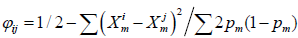  
KING robust covariance matrices are being implemented.

```
Reference:
1. Manichaikul, A., et al., Robust relationship inference in genome-wide association studies.
   Bioinformatics, 2010. 26(22): p. 2867-73.
```

#### Runtime options
```
--write_binary_gmatrix_file               Additive matrix calculation
--write_binary_dmatrix_file               Dominance matrix calculation
--binary_genotype_filename <SxM file>     A subject-by-marker binary genotype file
--binary_output_filename <file>           Output filename
--group_size <num>        Controls the subject-by-subject group size that is computed to fill in binary.
                          This option impacts that memory footprint at the subject level.
                          Generally the group_size should be as large as possible for efficiency.
--pooled_variance         Use 2nd definition of above matrices. Note that pooled variance is less impacted by MAF.
--single_pedigree         Generate pairwise covariance values for all subjects, independent of the pedigree.
--write_matrix_counts     Add counts to the binary output file. Required if genomic matrices are to be combined.
                          Default is to write pairwise counts base on observed data.
--use_complete_data_count Uses the number of markers for nij in the above formulas to compute the average.
                          Can be combined with –write_matrix_counts.
--num_mkl_threads <num>                       Parallelization for MKL matrix multiplication
--autosome                                    Extract the autosomal SNPs
--chromosome <numbers>                        Extract SNP on chromosomes in <numbers>
--genomic_region <chr> <start bp> <stop bp>   Extract SNPs in the genomic region(s) specified.
--marker_set <file>                           Use markers in <file>
--subject_set <file>                          Use subjects in <file>
--min_minor_allele_frequency <value>          Restrict analysis to markers with MAF greater than <value>.
                                              Not used for imputed data.
```

#### PC calculations
```
MMAP computes the PCs then outputs to csv delimited file.

--compute_pc_file                 MMAP option
--binary_input_filename <file>    Binary covariance file to extract PCs
--max_pcs2print <num>             Print the <num> PCs with largest eigenvalues
--pc_output_filename <file>       Output file for the PCs. Sorted by largest to smallest eigenvalue
--subject_set <file>              Restrict the PC calculation to subjects in the file.
                                  Note that in practice PCs are computed for all subjects in binary
                                  then used for all downstream analyses independent of the number of
                                  subjects in the phenotype file. The PCs restricted to subsets of the
                                  subjects are no longer orthogonal, but the impact is minimal.
--print_scaled_pcs                Also print eigenvectors scaled by the sqrt of the eigenvalue
```

#### Extracting Values from Matrix
```
There are two options to extract the pairwise values from a binary covariance matrix and an option
to extract the full matrix. Subject set options are being added to be able extract specified subjects.

--variance_component_matrix_mmap2pairs        Output each pair once. The order depends on the order of the 
                                              subjects in the file. The output is the upper diagonal of the matrix.
--variance_component_matrix_mmap2pairs_all    Output each pair of different subjects twice with opposite orders.
                                              The output is the full matrix.
--variance_component_matrix_mmap2matrix       Rectangular output with the subject ids as the first row.

Both options require:
--binary_input_filename <file> --csv_output_filename <file>
```

#### Combining Genomic Matrices
```
--combine_binary_matrix_files <file list>     List of files to be combined. They must all be of the same count type,
                                              that is, have been created with the same --write_matrix_counts option
                                              with or without the --use_complete_data_count option.
--binary_output_filename <output file>        Name of the combined genomic matrix file
```

#### Example Commands
- Double precision, pairwise adjustment to average, group size 4000 and autosome markers included. Running time 3xtime(SP).
`mmap --write_binary_gmatrix_file --binary_genotype_filename <SxM file> --binary_output_filename study.0.5.bin --group_size 4000 --single_pedigree --num_mkl_threads 4 --min_minor_allele_frequency 0.05 --autosome`

- Bash shell commands to create dominance matrix by chromosome then combine into single file. Group size is 1000. Single precision and constant adjustment to average, so running time is time(SP)

```
for chr in {1..22}
do
   mmap --write_binary_dmatrix_file --binary_genotype_filename <SxM file> 
   --binary_output_filename dom.${chr}.0.5.bin --group_size 1000 --single_pedigree 
   --write_matrix_counts --num_mkl_threads 4 --min_minor_allele_frequency 0.05 –chromosome ${chr} 
   -–single_precision -–use_complete_data_count
done

filelist=`ls dom.*.0.5.bin`
mmap --combine_binary_matrix_files $filelist --binary_output_filename dom.auto.0.5.bin

```
- Bash shell commands to create leave-one-chromosome out (LOO) matrices

```
# get file list. Assume all files have name G.<chr>.bin
ls G.*.bin > filelist
list=`cat filelist`
for loo in {1..22}
do
   # delete loo chromosome
   grep -v $loo filelist >loolist
   looinput=`cat loolist`
   # combine the 21 gmatrices
   $prog --combine_binary_matrix_files $looinput --binary_output_filename G.LOO.${loo}.bin
done

# combine for autosome file
$prog --combine_binary_matrix_files $filelist --binary_output_filename G.autosome.bin
```

---

<p><a id="variance_components" title=" &nbsp; 5. Variance Components" class="toc-item"></a></p>

### Estimating Variance Components in MMAP

MMAP implements routines to estimate variance components within the mixed model. These estimates can be used for likelihood ratio tests to compare model fits or as null model estimates for score tests. Estimates of individual random effects are provided for analysis or as residuals for additional analyses such as score tests. Any number of random effects can be modeled. These can include any combination of pedigree, genomic, omic and environment effects. Non-heteroscedastic errors can be modeled to allow group-specific variances such as by-gender (gQTLs) or by-genotype (vQTLS).

See the documentation on covariance matrices and genomic matrices for constructing matrices to model the random effects and the score test for rare variant testing.

**Command line options:**  
The pedigree, phenotype and trait options are as described previously.

```
--ped <pedigree filename>
--phenotype_filename <filename>
--trait <trait>
--covariates <covariates>
```

#### <u>Variance Component Likelihood Estimation</u>

`--estimate variance components`

Specifies that a variance component model is to be run.

`--binary_covariance_filename <filename 1> <filename 2> …. < filename N>`

`<filename J>` corresponds to the Jth variance component to be estimated in the model. The residual error is assumed homoscedastic and is the N+1st variance term (see below for more general residual error models). The format of the variance component file is specific to MMAP. MMAP has options to create a variety standard covariance matrices based on pedigree that include additive, dominance, epistasis, maternal and paternal imprinting, X chromosome. Covariance matrices using genetic data include additive, dominance and epistasis (instructions on how to create them are in the **Genomic Matrices** information above).

`--variance_component_label <label 1> <label 2> … <label N>`

Label is used in the output file to distinguish the variance component names. If no label is supplied the default label VAR is used. For example, the label for the kinship matrix might be A, for epistasis AA and dominance D and genomic matrix G.

The default model assume heteroscedastic error (identity matrix), but more general residuals errors can be modeled, for example, multiple measurements, sexual dimorphism, variance-heterogeneity QTLs (vQTLs). Currently these error matrices are assumed diagonal.

`--error_variance_componen_filename <filename 1> <filename 2> …. < filename N>`

`<filename J>` corresponds to the Jth error variance component to be estimated in the model. These matrices are diagonal, so represented by a csv file with header with first column the subject id and second the diagonal value. For example, to estimate male and female variances separately there would be one file with for males containing 0 for each female and 1 for each male. The female file would be dual to this. Alternately, one could model the error using a file with all 1’s, then add either the female or male file. This model can then be compared to the homoscedastic model as a nested model. For vQTLs the matrices would have 1’s for the genotype class, 0’s otherwise.

`--error_variance_component_label <label 1> <label 2> … <label N>`

Label is used in the output file to distinguish the error variance component names.

**Likelihood Options**

MMAP implements 4 different options for REML likelihood estimation: EM-REML, AI-REML, Fisher information and Newton-Raphson. Both Fisher information and Netwon-Raphson involve a trace of matrix products that is computationally expensive, so NOT recommended. AI-REML uses the average information of these two methods, which eliminates the trace term, leading to faster computational algorithm. EM-REML if often combined with AI-REML to provide initial estimates.

`--use_em_ai_reml`

Use EM-REML then switch AI-REML after number iterations

`--num_em_reml_burnin <num iterations>`

The number of EM –REML iterations prior to switching to AI-REML.

`--use_ai_reml`

Use AI-REML.

`--use_newton_raphson`

Use the Hessian matrix of second derivatives of the likelihood function in the information matrix. Option is more computationally more expensive than AI-REML. RECOMMEND DO NOT USE.

`--use_fisher_information`

Use Fisher information matrix, which is the expected value of the Hessian matrix. Option is more computationally expensive than AI-REML. RECOMMEND DO NOT USE.

`--add_likelihood_constant`

The likelihood has a constant term that does not impact maximization. The constant can be dropped or retained in the final output. The default in MMAP is to drop, but this option will retain the constant. The option is used if comparing MMAP results to another program that retains the constant.

`--null_likelihood <val>`

If this option is present a likelihood ratio test will be performed using the likelihood of the current model and the `<val>`. The output file `<trait>.<suffix>.variance.components.T.csv` (see below) will have the p-value of the test in LRT_PVAL. This option is useful for comparing nested models, for example, in IBD or IBS linkage analysis, or constructing null models for score tests, where `<val>` is LN_LIKE from the baseline model. For example, for linkage a model with the A matrix is run, LN_LIKE extracted, then added to the model with A and the IBD matrix with this option.

#### <u>Matrix operations</u>

MMAP uses the Intel Math Kernel Library (MKL) http://software.intel.com/en-us/intel-mkl/ for matrix operations. The likelihood equation involves inverting the dense marginal covariance matrix, which is the primary computational challenge. MKL has two main routines for matrix inversion: DPOTRS and DPOTRI. Performance between the two routines seems to depend on the number of threads. MMAP has options to compute the likelihood using single or double precision matrices or a combination of each. Single precision takes have the memory and is twic as fast, but convergence of the maximization routines might be impacted.

`--use_dpotrs`

Use single precision BLAS routine DPOTRS for matrix inversion.

`--use_spotrs`

Use single precision BLAS routine SPOTRS for matrix inversion. Requires half the memory and is approximately twice as fast as DPORTS.

`--use_spotrs_dpotrs`

Use single precision BLAS routine SPOTRS until convergence reaches a pre-specified tolerance, and then switches to double precision BLAS routine DPOTRS until final convergence. The hybrid option is useful for large datasets.

`--use_dpotri`

Use single precision BLAS routine DPOTRI for matrix inversion.

`--use_spotri`

Use single precision BLAS routine SPOTRI for matrix inversion. Requires half the memory and is approximately twice as fast as DPORTI.

`--use_spotri_dpotri`

Use single precision BLAS routine SPOTRI until convergence reaches a pre-specified tolerance, and then switches to double precision BLAS routine DPOTRI until final convergence. The hybrid option is useful for large datasets.

`--num_mkl_threads <num threads>'

Specifies the number of threads to use for the matrix operations. Default is 1 one thread. Parallelization can provide significant performance increase for computing the variance estimates under the null with large data sets with dense covariance matrices.

`--num_iterations <val>`

Sets the maximum number of iterations for the variance component estimation. The default is 500 which would only potentially be needed if the optimization were EM-REML only. AI-REML converges generally in 10-20 iterations. A single iteration can be used to generate estimates of the random effects at a user-specified variance estimates.

#### <u>Setting Initial Estimates</u>

Setting the initial estimates of the variances or the ratio of the variance estimates in general does not have a significant impact on the number of AI-REML iterations. However, one application would be to set the values to external variance estimates to generate estimates of random effects using the `-–num_iterations 1` option to be used for additional analysis such as prediction.

`--initial_variance_component_values <val 1> <val 2> … <val N>`

The values of the variances to seed the estimation procedure. Includes the error term

`--initial_variance_component_lambdas <val 1> <val 2> … <val N>`

The values of the variance component/total variance ratios. Easier to set than the actual variances. For example, if the heritability is assume 0.2 then an initial values would be 0.2 0.8 with a model with the kinship coefficient.

`--write_projection_matrix_file <filename>`

Write the projection matrix P at the REML estimate under the null to a binary file. Useful for multiple runs where the null does not change to avoid recomputing P. For example, running a single chromosome at a time or changing the definition of snp set to model different pathways. Note that if the null models changes, for example, adding SNPs in conditional analysis, a new P needs to be computed. Not yet implemented.

`--read_projection_matrix_file <filename>`

Read in a projection matrix `<filename>`. _Not yet implemented._

#### <u>Handling Large Data</u>

The memory footprint of the analysis depends on the number subjects and the number of variance components in the model. For example, with 100,000 subjects, the memory needed for each covariance matrix is 100K x 100K x 8 bytes = 80 Gb. If the analysis was estimating the contribution of each human autosome and the X chromosome using genetic data, then the requirement would 80 Gb x 23 = 1.7 Tb. We have implemented options to trade memory for disk reads to be able to reduce the memory footprint to that required by a single variance component independent of the number of components in the model. Thus, the above example with 23 components and error would require 80 Gb. An analysis of 250,000 subjects would require 500 Gb. The running time depends on the number of cores available. Our analysis of additive and dominance components in 90,000 cows using 20 cores required under 5 hours.

`--create_inverse_from_disk --write_disk_variance_component_filename <filename 1> <filename 2> …. < filename N>`

There must be the same number of filenames as used in --binary_covariance_filename option. These files are temporary and can be deleted after the run.

#### <u>Output files</u>

`<trait>.<suffix>.variance.components.T.csv`

Contains the estimates and standard errors of the variance components and fixed effects. P-values of the fixed effects and likelihood are also provided.

`<trait>.<suffix>.variance.components.model.csv`

Contains the estimates of the fixed and random effects for each individual used in the analysis. Zscores of the random effects are also provide for ranking by standard deviations from the population mean. The <trait>_ERROR term can be used as a residual in linear regression. If multiple residual error terms are modeled then the term <trait>_COMBINED_ERROR is the sum of the error terms and can be used as the residual.

#### <u>Example MMAP commands</u>

**Family data:** Command run score test with null model BMI = mean + sex + age + sex*age+ a + x + mt + e, where sex, age, and sex-by-age interaction are fixed effects, g is the additive random effect with label A and covariance matrix kinship.bin, x is the X chromosome effect with label X and covariance matrix Xchr.bin and mt is the mitochondrial random effect with label MT and covariance matrix MT.bin. The MT.bin is constructed as a 0-1 matrix grouping maternal lineages. Estimation of the variances use EM-REML for 2 iterations, then AI-REML using DPOTRS and two threads.

`mmap --ped pedigree.csv --phenotype_filename phenotype.csv --trait BMI --estimate_variance_components --variance_component_filename kinship.bin Xchr.bin MT.bin --num_em_reml_burnin 2 --use_em_ai_reml --use_dpotrs --variance_component_label A X MT --covariates sex age --interaction age* --file_suffix G.X --num_mkl_threads 2`

#### <u>Simulated test data</u>

Under development

---

<p><a id="covariance_matrices" title=" &nbsp; 6. Covariance Matrices" class="toc-item"></a></p>

### MMAP Covariance Structures

MMAP has options to compute pedigree-based, genomic and environmental covariance matrices as well as user-defined covariance structures. These covariance structures represent random effects in the mixed model. These matrices can be used in variance component estimation and other genetic analyses such as GWA. Interactions of the random effects can be modeled using the pointwise (Hadamard product) of individual matrices. See documentation on genomic matrices for options of working with genetic data.

MMAP requires the first 5 fields of the pedigree file to be pedigree id, ego, father id, mother id and sex, although the token used for each is not used. All other fields, if any, are ignored.

MMAP requires ancestral order of the pedigree for the gametic and kinship matrix calculations and will exit if the not properly ordered. The file pedigree.err contains the list of subjects that are out of order and their location in the pedigree file and can be used for manual correction of the pedigree file. Automated correction may be added in the future.

#### <u>Pedigree</u>

`--compute_binary_relationship_matrix_by_groups`  
Required

`--ped <pedigree>`  
Pedigree csv input filename

`--binary_output_filename <file>`  
Output filename for the covariance matrix.

`--group_size <num>`  
Controls the subpedigree size to control the memory. This generally is set to the number of subjects in the file unless the pedigree size if above several hundred thousand.

`--single_pedigree`  
Treats all pedigrees as a single pedigree. The covariance file will have zero values for subjects in different pedigrees, but the option is HIGHLY RECOMMENDED if the relationship matrix is to be combined with any other covariance matrices that have between-pedigree covariance values such as genomic matrices. MMAP uses the grouping variable in the pedigree file, so for analysis with the

`--xlinked_relationship_matrix`  
X linked relationship matrix

#### <u>Example Commands</u>

Autosome  
`mmap –compute_binary_relationship_matrix_by_groups --ped Amish.ped.csv --binary_output_filename Amish.autosome.relationship.bin --group_size 25000 --single_pedigree`  

X chromosome  
`mmap –compute_binary_relationship_matrix_by_groups --ped Amish.ped.csv --binary_output_filename Amish.X.relationship.bin --group_size 25000 --single_pedigree –xlinked_relationship_matrix'`  

#### <u>Pedigree Common Environment and Cytoplasmic inheritance</u>

MMAP can construct 0-1 matrices to model common environment and cytoplasmic inheritance.

`--y_chromosome_covariance`  
Traces Y lineage.

`--mitochondrial_covariance`  
Traces maternal lineage

`--full_sib_covariance`  
Groups full sibs

`--spouse_covariance`  
Groups spouses

`--nuclear_family_covariance`  
Groups nuclear families within a pedigree

**Each option REQUIRES**

`--ped <pedigree>`  

`--binary_output_filename <file>`  
Name of output file

`--pedigree_output_filename <file>`  
Contains the pedigree plus an extra column with numerical value for each group

#### <u>Permanent Environment or Group Covariance Matrices</u>

MMAP can construct a random effect based on a grouping variable such as sex, study, plate, generation, etc, from a categorical or numerical variable in a csv file. The matrix is 0-1 with 1 in the (J,K) entry if subject J and subject K are in the same group, 0 otherwise. Missing data is treated as an independent group, that is, with a 1 for that individual on the diagonal.

`--compute_group_covariance_file`  

`--phentoype_id <ID>`  
Required. The header token that identifies the subject ID

`--group_variable <string>`  
Required. The header token that identifies the grouping variable

`--csv_input_filename <file>`  
Required. The csv input file with subjects and grouping variable

`--binary_output_filename <file>`  
Required. Binary covariance filename.

#### <u>Custom Covariance Matrices</u>

MMAP can import user generated matrices in two formats to facilitate integration of output from 3rd party software that for example compute IBD matrices or omics-type matrices such as normalized gene expression. These options assume txt not csv files since txt is more common output format from other programs.

For files formatted IDA IDB `<val>` use the following option. This option assumes upper triangular order as the default. That is if there are N subjects in the file, then IDA is the first subject for lines 1 to N, the second subject for lines N+1 to N-1, etc, with IDB varying for each line. Thus the file is expected to have N*(N+1)/2 lines plus 1 for the header, which can be skipped. The file is assumed to have a header.

`--pairwise_value_txt2mmap`  

`--txt_input_filename <file>`  
Required.

`--binary_output_filename <file>`  
Required.

`--no_header`  
Optional. Add if the file has no header line.

`--idB`  
Optional. Add if the IDB column is constant while IDA varies.

For rectangular NxN files with the first line containing the subject ids use the following option  
`--square_matrix_txt2mmap`

`--txt_input_filename <file>`  
Required.

`--binary_output_filename <file>`  
Required.

#### <u>Extracting Values from Matrix</u>

There are two options to extract the pairwise values from a binary covariance matrix and an option to extract the full matrix. Subject set options are being added to be able extract specified subjects.

`--variance_component_matrix_mmap2pairs`  
Output each pair once. The order depends on the order of the subjects in the file. The output is the upper diagonal of the matrix

`--variance_component_matrix_mmap2pairs_all`  
Output each pair of different subjects twice with opposite orders. The output is the full matrix

`--variance_component_matrix_mmap2matrix`  
Rectangular output with the subject ids as the first row.

Both options require:  
`--binary_input_filename <file> --csv_output_filename <file>`

#### <u>Interaction</u>
MMAP can model interactions between random effects using the pointwise product of two covariance matrices. MMAP assumes the matrices have the same subjects in each matrix.

`--hadamard_product_two_covariance_matrices`

`--variance_component_filename <file1> <file2>`  
The two covariance matrices to be multiplied

`--binary_output_filename <file>`  
The product matrix filename

---

<p><a id="interactions" title=" &nbsp; 7. Interactions" class="toc-item"></a></p>

### MMAP Interaction Analysis

MMAP implements both fixed and random effects interaction models. Interactions can be fit as a
single model and GxE can be run genome wide. We have also implemented analysis of
variance-heterogeneity QTLs, called vQTLs, which will be fully documented pending submission
of a manuscript.

#### <u>Fixed effect interactions</u>

`--covariates <covariates>`  
List of covariates included in the model.

`--interactions <interaction terms>`  
Interactions are coded using the ‘&ast;’ delimiter. For example, AGE&ast;SEX models the interaction
between the covariates AGE and SEX and AGE&ast;SEX&ast;BMI the 3-way interaction between
AGE,SEX, and BMI. Interaction covariates do not need to be modeled as main effects nor 2-
way interactions in the case of the 3-way interaction, though it is standard to include the
combinatorial possibilities.

#### <u>GxE interactions</u>

`--gxe_interaction <covariate>`  
Run a Gx<covariate> GWA, where G is determined from the model options and genotype file.
This option currently requires that <covariate> is also listed in the –covariate option. The output
will include the GxE beta, standard error, p-value and covariance between the G beta and E
beta. This option requires the option --binary_covariate_filename <file> where <file> is an
MxS binary genotype file.

MMAP searches for covariates in the following order:
1. Phenotype file
2. Covariate files, if any, in the order listed in the –covariate_filename option.
3. Binary genotype file that contains genotype data.

MMAP uses the first instance of the covariate found. So if BMI is found in the phenotype file,
then BMI would be ignored in the covariate files, if any and present. There is no merging of
covariate variables across files. Covariates in interaction terms need not be in the same file.
SNP covariates in the `--interaction` models can be in covariate file directly or extracted from the
binary genotype file using the option `--binary_covariate_filename <file>`. However, there is an
important difference between the two options. If the SNP is in the covariate file, then missing
genotypes have to be coded as blank or NA, which results in those subjects being excluded
from the analysis. If the SNP is extracted from the binary genotype file, then missing data is
imputed to the population average of the subjects in the analysis (not genotype file). Thus, the
number of individuals analyzed may be different between the two approaches when genotype
data is missing. We may add an option to use only observed data in the future, but the
option `--subject_set` with the ids of the individuals with genotype data can be used to restrict the analysis.
Also the imputed value for missing data is based on the subjects in the analysis, so the analysis
is not impacted if genotype file has mixed ethnicities.

#### <u>Robust Standard Errors</u>

#### Linear Regression
For linear regression MMAP implements a menu of heteroskedasticity consistent (HC)
estimators HC0 (Huber-White), HC1, HC2, HC3, HC4, HC4m and HC5 as defined in the R
[sandwich](http://cran.r-project.org/web/packages/sandwich/index.html){:target="_blank"} package. These estimators model the variance of the beta estimate as  with diagonal matrix 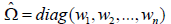 where the choice
of weights 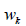 is determined by the HC model. 

The weights are generally a function of the
residuals 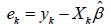 and diagonals 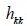 of the
Hat matrix 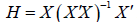. For example
the Huber-White weights are 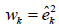 and the weights for HC3 are 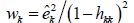 .

Any combination of the six sandwich estimators can be included in the regression analysis.
```
--hc0_sandwich_estimator
--hc1_sandwich_estimator
--hc2_sandwich_estimator
--hc3_sandwich_estimator estimator
--hc4_sandwich_estimator
--hc4m_sandwich_estimator
--hc5_sandwich_estimator
```
The MMAP output will contain HC0, HC1, HC2, HC3, HC4, HC4m and HC5 prefixed columns
containing the estimates for the standard errors and the p-values. Note that the betas are not
changed by the sandwich estimators. If sandwich estimators are included in the interaction
model, the robust covariance estimates are also provided in the `<trait>.<prefix>.mle.pval.csv`
output file.

#### Mixed model

In the mixed model the variance structure V is not the identity, thus
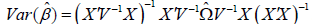. The sandwich 
that is currently supported is 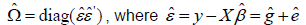 which corresponds to the formula for the Huber-White
HC0 estimator. This matrix is diagonal so it models the variance of Y treating individuals as
independent clusters. There are no hat options at the moment as computing the Hat matrix
requires greater computational burden.

This is a work in progress so other formulations that may be more appropriate are being
researched, for example, 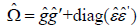. If there is any concern regarding the HC0 model,
then an alternative strategy is use MMAP to fit the baseline variance component model, say
polygenic model, then use the error residuals in output file as the phenotype in the linear
regression (--linear_regression). These residuals are then independent.
The required option is `--empirical_sandwich` and the output file will have HC0 as the header.

Notes:
1. For GxE interaction meta-analysis plans, the robust estimators refer to Huber-White (--HC0
and --empirical_estimator). The properties of other HC estimators for genetic analysis has
not been investigated.
2. Currently the calculation of robust estimators is not optimized with MKL libraries.

#### <u>Example MMAP commands</u>

#### Linear Model

`mmap [ped, trait, covariate, genotype options] --linear_regression --hc_sandwich_estimator --
hc1_sandwich_esimator --hc2_sandwich_sandwich`

#### Mixed Model

`mmap [ped, trait, covariate, genotype options] --read_binary_relationship_matrix <file> --empirical_sandwich`  
Sandwich package: [http://cran.r-project.org/web/packages/sandwich/index.html](http://cran.r-project.org/web/packages/sandwich/index.html){:target="_blank"}

---

<p><a id="score_tests" title="Score Tests / SKAT" class="toc-item"></a></p>

### Score Tests / SKAT

| Score&nbsp;Tests&nbsp;including&nbsp;SKAT&nbsp;&nbsp;&nbsp;&nbsp; | Documentation file |
|---|---|
| MMAP documentation for score tests | [MMAP.score.tests.pdf](files/MMAP.score.tests.pdf){:target="_blank"} |
| R script to convert MMAP prepScores output into a skatCohort object | [mmap2seqMeta.R](files/mmap2seqMeta.R) |
| MMAP scripts and examples for running score tests | [MMAP.score.test.tar.gz](files/MMAP.score.test.tar.gz) |
| MMAP snpinfo file used in CHARGE exome chip analysis | [<small>SNPInfo_HumanExome_12v1_rev5_AnalysisCols_noDups.tab</small>](files/SNPInfo_HumanExome_12v1_rev5_AnalysisCols_noDups.tab) |

### Running Score Tests in MMAP

MMAP implements score tests as an extension of routines that estimate variance components within the mixed model. The variance component routines are used to compute the variance estimates under the null model and compute the residuals, which are then used in the score test. These score tests can be structured to include any number of random effects in the null model such as additive, dominance, epistasis, permanent environment, genomic and heteroscedastic errors in both population and family data. The simplest model for population data would be an error term and for family data a polygenic effect and error term.

MMAP can perform general SNP set testing but we assume rare variant testing for ease of presentation. MMAP uses that standard two step approach. First, the score statistics and covariance matrix are computed and save to a file. These results are then used for rare variant tests and meta analysis. Currently we implement a SKAT and burden test, but are working on additional tests. We also have an option to create a txt output file that can be can converted into an R object that can be used with the seqMeta R package [1] for variant or analysis. We are also working on an interface to rvtests [2] and raremetalworker [3].

#### <u>Command line options</u>

The pedigree, phenotype and trait options are as described previously.
```
--ped <pedigree filename>
--phenotype_filename <filename>
--trait <trait>
--covariates <covariates>
```

#### <u>Genotype Data</u>

`--binary_genotype_filename <filename>`  
Binary formatted genotype file in marker-by-subject (MxS) format as described previously. Note that when converting a csv file to MMAP format non-autosome chromosome names should be X,Y,XY and MT, not a numerical value. If the binary genotype file was created from Plink files, the conversion is done automatically.

#### <u>Missing genotype data</u>

Missing genotypes are imputed to the average dosage based on the subjects in the analysis, called the sample frequencies, not the total subjects in the genotype file, called the population frequencies. To use population frequencies add the option `--use_population_frequencies`. The minor allele frequency may differ significantly between the two if the population comprises different genetic groups and the subjects being analyzed are from only one of them. For example, if the genotyped sample subjects are monomorphic for a rare effect allele, then the
SNP remains monomorphic after imputing missing genotypes, but if the allele is present in the genotyped population then missing data is imputed to a non-zero dosage.

#### <u>X chromosome</u>

The allele frequency on the X chromosome is computed using both males and females, but with males contributing a single allele in both numerator and denominator. Male genotypes are coded 0/2 and missing data for both sexes is assigned the mean dosage. The option `--x_male_coding_01` will code males as 0/1 with missing data in males assigned half the mean dosage. The male coding does not impact the value of the mean dosage as that is determined by allele frequencies. Male heterozygous genotypes are treated as missing data, thus, do not contribute to the allele frequency estimation and are assigned the appropriate missing value.

`--binary_covariate_filename <filename>`  
Option allows the binary genotype file to be used as a covariate to facilitate including SNPs as covariates such as conditional and interaction analysis. **Note that when genotypes are entered as covariates in the model missing genotypes are NOT imputed to sample averages as is done for SNP analysis, thus subjects missing genotypes are dropped from the analysis.** [option to impute is being added]

#### <u>Score Tests</u>

To perform score tests additional options are added to the variance component estimation routines [see variance component documentation for details]. Currently the format follows the seqMeta package used by CHARGE that requires a SNP info file that groups the variants into genes or other clusters.

`--score_test`  
Option to run score test and requires the option –snp_info_filename.

`--snp_info_filename <filename>`  
A **tab** delimited file with marker and gene with header, say **Locus** and **SNPset**. The file is tab delimited to account for formats that where a gene comprises multiple gene names separated by a comma. The file header is actually not used at the moment, so can any two names can be used. Chromosome information for marker is assumed to be present in the binary genotype file. A snp info file compatible with the CHARGE exome chip analysis plan is available for download on the website. We may expand the allowable format to include chromosome and position information.

`--gene_set <filename>`  
Specify a set of genes to include in the analysis for a subset analysis. The file has one gene name per row with no header.

`--output_prepscores_file`  
Output a text file the can be converted into a seqMeta preScores R object with [mmap2seqmeta.R](files/mmap2seqMeta.R) (see description below).

#### <u>Output files</u>

`<trait>.<suffix>.skat.res.bin`  
Binary file containing scores and covariance matrix used for rare variant testing and meta analysis.

`<trait>.<suffix>.prepscores.txt`  
Produced with the `---output_prepscores_file`. A tab delimited file that contains the sample size, standard error, gene name, marker names, score test and LD matrix that can be converted using the script mmap2seqmeta.R into an R object that can be input into seqMeta for running rare variant tests.

Converting MMAP output to seqMeta R object

`mmap2seqmeta.R <trait>.<suffix>.prepscores.txt <output filename> <R name>`  
R script to convert MMAP output file to an R object for input into seqMeta. \<R name\> is the name assigned when running prepScores that will be used in the skatMeta call. For example,  
```
<R Name><-prepScores(…) and  
skatMeta(<R name>,SNPInfo=SNPInfo,snpName=”Name”,aggregateBy=”gene”)
```

#### <u>Example MMAP commands</u>

**Family data:** Command run score test with null model BMI = mean + sex + age + sex*age + exm10 + exm20 + g + e, where sex, age, and sex-by-age interaction are fixed effects, SNPs exm10 and exm20 are also fixed effects and read from the binary genotype file exome.MxS.bin, g is the additive random effect with label A and modeled by covariance matrix kinship.bin. Estimation of the variances use EM-REML for 1 iteration, then AI-REML using DPOTRS and two threads. The reported likelihood includes the constant term. A text file that contains the seqMeta prepScores output is produced.

`mmap --score_test --snpinfo_filename snpinfo.txt --binary_genotype_filename exome.MxS.bin --ped pedigree.csv --phenotype_filename phenotype.csv --trait BMI --estimate_variance_components --variance_component_filename kinship.bin --num_em_reml_burnin 1 --use_em_ai_reml --use_dpotrs --variance_component_label A --covariates sex age exm10 exm20 --add_likelihood_constant --interaction age*sex --binary_covariate_filename exome.MxS.bin --file_suffix exome.conditional --num_mkl_threads 2 –output_prepscores_file`

**Population data:** Same model as above but excluding the polygenic component. The –single_pedigree is required when treating subjects as single cluster.

`mmap --read_snpinfo_file snpinfo.txt --binary_genotype_filename exome.MxS.bin --ped pedigree.csv --phenotype_filename phenotype.csv --trait BMI --covariates sex age exm10 exm20 --add_likelihood_constant –interaction age*sex --score_test_weight wu --binary_covariate_filename exome.MxS.bin --file_suffix exome.conditional –single_pedigree –output_prepscores_file`

#### <u>Rare Variant Tests</u>

The input file(s) are of the form <trait>.<suffix>.skat.res.bin. When more than one file is present the results are meta analyzed. The csv output file contains the results of the analysis.

`--burden_meta <input file(s)> –max_minor_allele_frequency <maf> --csv_output_filename <output file>`  
Perform burden test using MAF cutoff.

`--skat_meta <input file(s)> --score_test_weight wu csv_output_filename <output file>`  
SKAT tests using Wu weights. Other weight functions to be added.

Output: `<trait>.<suffix>.skat.res.txt`

The file contains the results of the score test using the Wu weights. P-values are computed using Kuonen’s algorithm. The file format is similar to the output format of skatMeta in seqMeta.

#### <u>Computational considerations</u>

There are two main computations for the score test: (1) estimating the variance components and (2) computing the score statistics. For family studies that consist of many pedigrees with a small number of subjects, (1) is most efficient treating each pedigree as its own cluster, but (2) is most efficient treating the pedigrees as a single pedigree with the option `–single_pedigree` added to the command line. The reason is that the advantage of MKL for matrix multiplication increases as the matrices become larger. Thus, if running MMAP across many phenotypes, it might be useful to determine if `--single_pedigree` increases overall performance using a single phenotype. The same recommendation holds for determining if parallelization with threads should be used.

#### <u>Comparing MMAP and seqMeta</u>

Since prepScores fits the null model using coxme::lmekin with method=”REML” the estimates of the model fit will be the same as MMAP and the log likelihoods will match if it the option `--add_likelihood_constant` is included in the MMAP run. The skatMeta results should match between the programs (within numerical roundoff).

**IMPORTANT: When comparing MMAP and seqMeta for family data the kinship matrix in prepScores must be ordered the same as the phenotype data, otherwise the results will not be correct.**

#### <u>Parallelization</u>

The score test can be parallelized by breaking up the SNPInfo into smaller files. The seqMeta R objects would then be combined within R. Another option us to use the thread option available for the matrix operations.

#### <u>Null models</u>

Determining the appropriate null model variance components can be done prior to the score test calculation using goodness of fit testing. For example addition of a dominance, X chromosome and/or mitochondria random effect to the additive effect can be tested using likelihood ratio test by starting with the additive component then including the other components one at a time. If the X chromosome effect does not provide a better fit (choose p-value cutoff) then the component is not needed in the null even if X chromosome variants are tested. Likewise, if the is significant X chromosome contribution to the phenotype, then the X random effect can be included when autosome variants are tested. Dominance, X and MT contributions are second order, so in general, their estimates may be zero. Similar goodness of fit testing can be done for environmental random effects such as sib or nuclear family.

#### <u>Simulated test data</u>

The file [MMAP.score.test.tar.gz](files/MMAP.score.test.tar.gz) contains files and scripts to run MMAP on a small simulated data set. The genotype file has no missing data, so the algorithm to fill in missing data is not being tested. More example data sets and a tutorial are being developed.

**Future directions:**

1. Implement SNP set score tests as described in [4]. These tests focus on common variants in genes, pathways etc, and implements non-linear kernel functions for IBS sharing that are not derived as products of the SNP data matrix.
2. Implement the model used by rvtests and raremetalworker that are being used in GIANT exome chip analysis. The input formats and output are different than seqMeta, so a comparison is useful.
3. GLMM for binary traits.

**References**

1. Voorman A, Brody J, Chen H, Lumley T. seqMeta: An R package for meta-analyzing region-based tests of rare DNA variants 2013. Available from: [http://cran.r-project.org/web/packages/seqMeta/](http://cran.r-project.org/web/packages/seqMeta/){:target="_blank"}.
2. Zhan X. rvtests 2014. Available from:[https://github.com/zhanxw/rvtests](https://github.com/zhanxw/rvtests){:target="_blank"}.
3. Abacasis G. RAREMETALWORKER 2013. Available from: [http://genome.sph.umich.edu/wiki/RAREMETALWORKER](http://genome.sph.umich.edu/wiki/RAREMETALWORKER){:target="_blank"}.
4. Schifano ED, Epstein MP, Bielak LF, Jhun MA, Kardia SL, Peyser PA, Lin X. SNP Set Association Analysis for Familial Data. Genetic epidemiology. 2012. doi: 10.1002/gepi.21676. PubMed PMID: 22968922; PubMed Central PMCID: PMC3683469.

---

<p align="center">MMAP: Mixed Model Analysis for Pedigrees and Populations - Copyright © 2017</p>
&nbsp;

<!-- And now for the javascript... -->
  <script type="text/javascript" src="https://ajax.googleapis.com/ajax/libs/jquery/1.7.1/jquery.min.js"></script>
  <script type="text/javascript" src="/assets/js_custom/application.js"></script>
